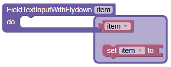

# field_text_input_flydown  [](https://www.npmjs.com/package/@rainbowmarket/field-text-input-flydown)

A custom Blockly field that provides a text input with a flydown menu.

You can see a demo version of a Blockly app that has integrated this plugin
[here](https://rainbowmarket.github.io/field_text_input_flydown/test/).  The code for that
demo is [here](https://github.com/Rainbowmarket/field_text_input_flydown).

## 🚀 Installation
To install this library, run the following command:
```sh
npm i @rainbowmarket/field-text-input-flydown
```

Or include it via CDN:
```html
<script src="https://unpkg.com/@rainbowmarket/field-text-input-flydown@latest"></script>
```

## 📌 Usage

### 1️⃣ Import the Library

#### ES Modules (Recommended)
```js
import { FieldTextInputWithFlydown, FieldFlydown } from '@rainbowmarket/field_text_input_flydown';
```

#### CommonJS (Node.js)
```js
const { FieldTextInputWithFlydown, FieldFlydown } = require('@rainbowmarket/field_text_input_flydown');
```

### 2️⃣ Define a Custom Block
You can define a block using either JavaScript or JSON.

#### Example XMLBlock String

```js
const xmlData = `
  <xml>
    <!-- A block for getting the value of a variable -->
    <block type="variables_get">
      <field name="VAR">{{text}}</field>  <!-- {{text}} = Dynamic value retrieved from the field -->
    </block>

    <!-- A block for setting the value of a variable with a custom text input flydown -->
    <block type="variables_set">
      <field name="VAR">{{text}}</field>  <!-- {{text}} = Dynamic value retrieved from the field -->
    </block>
  </xml>
`
```

#### JavaScript Example
```js
const custom_text_input = {
  init: function() {
    this.appendDummyInput('input')
      .appendField('FieldTextInputWithFlydown')
      .appendField(new FieldTextInputWithFlydown('item',/*optional*/ xmlData), 'TEXT');
    this.appendStatementInput('statement')
      .appendField('do');
    this.setTooltip('');
    this.setHelpUrl('');
    this.setColour(250);
  }
};
Blockly.common.defineBlocks({ custom_text_input: custom_text_input });
```

#### JSON Example
```js
Blockly.defineBlocksWithJsonArray([
  {
    "type": "custom_text_input",
    "tooltip": "",
    "helpUrl": "",
    "message0": "FieldTextInputWithFlydown %1 %2 do %3",
    "args0": [
      {
        "type": "field_text_input_with_flydown",
        "name": "NAME",
        "text": "item",
        "xmlData": xmlData
      },
      {
        "type": "input_dummy",
        "name": "input"
      },
      {
        "type": "input_statement",
        "name": "statement"
      }
    ],
    "colour": 250
  }
]);
```

### 3️⃣ Initialize Blockly with the Custom Field
After defining the block, inject Blockly and initialize your custom field:
```js
const workspace = Blockly.inject('blocklyDiv', {
  toolbox: document.getElementById('toolbox')
});
FieldFlydown.init(workspace);
```

## 📷 Example Block Image


## 🔧 Compatibility
Ensure that your Blockly version is **10.0.0 or later** for full compatibility.

## 📚 Explaining `{{text}}`

The `{{text}}` in the XML block definition is a **placeholder** for dynamically inserted text values that will be updated when interacting with the Blockly field. It represents a **dynamic value** that can be modified based on user input or logic in the Blockly environment. Specifically:

- **Dynamic Replacement**: The `{{text}}` will be replaced by a value, which is typically retrieved from a custom field (e.g., `FieldTextInputWithFlydown`).
- **Custom Field Usage**: In a custom Blockly field, like `FieldTextInputWithFlydown`, the text value will be retrieved and assigned dynamically, often using methods like `this.getText()`.

For example:
```xml
<field name="VAR">{{text}}</field>  <!-- {{text}} = Dynamic value retrieved from the field -->
```

In this case, `{{text}}` will be populated by the value of the text input or flydown field, allowing the block to work interactively.

## 🤝 Contributing
Feel free to fork the repository and submit pull requests with improvements!

## 📜 License
This project is licensed under the [MIT License](LICENSE).
